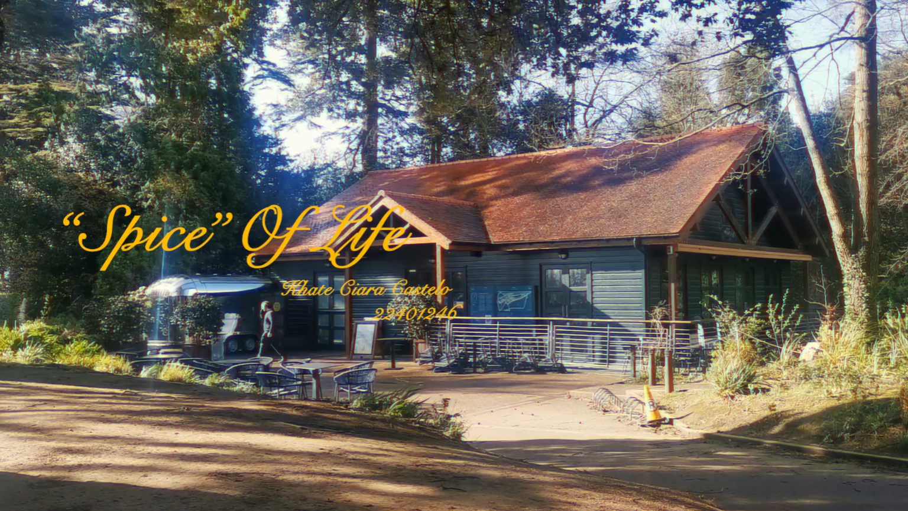

# "Spice" of Life 🖼️
CS261 Multimedia Technology project.  
Theme: Slice of Life.  
Using Abobe Premiere Pro.  

### The project
`"Spice" of Life` is a video showcasing my life in slices. It can also be described as an expression of appreciation towards my day to day life, showing scenes of the people I care, the places I travel, and the random moments I've captured. Every photo and video was recorded not only for the purpose of this project, but the moment I felt when first witnessed.  

- `myAnalysis.pdf`: contains the analysis, process, and decisions I've made in creating this video project.

### Criteria
- Create a 3 minute long video using at least 4 different video files, 4 different image files, and 4 different audio files.
-  An audio track demonstrating your ability to edit/ combine audio material and effects. 
- Contain atleast 2 video editing techiniques.
- Contain image editing techniques. 
 

 

 
 
 
 

> [!NOTE]
> Check out my video [here :)](https://youtu.be/3Tl3X9fd7cI)  
> P.S better with headphones 
